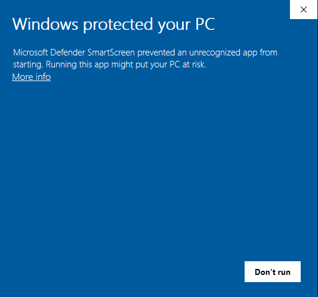

# MarkDown Editor By Daksh Desai 

### Hello everyone my name is Daksh Desai.
---

You can download the setup file from [Google Drive](https://drive.google.com/file/d/17Saf32RSnLaA6WbUn_p9HByg4jJoQfC6/view?usp=sharing)

---
This is an application to edit markdown files and also to export it in many different files

While installing this application via setup file will give you a error like this: 

---
This error is due to no code sign by me or no microsoft certificate added to this file. To run this application you can press More info and then run anyway.

### This file does not carry any virus.

### For any issues please post issue in issue box.

This application is made for competition between me, [Manan Gandhi](https://github.com/MananPyJava) and [Harshil Parikh](https://github.com/turbocoder21) 